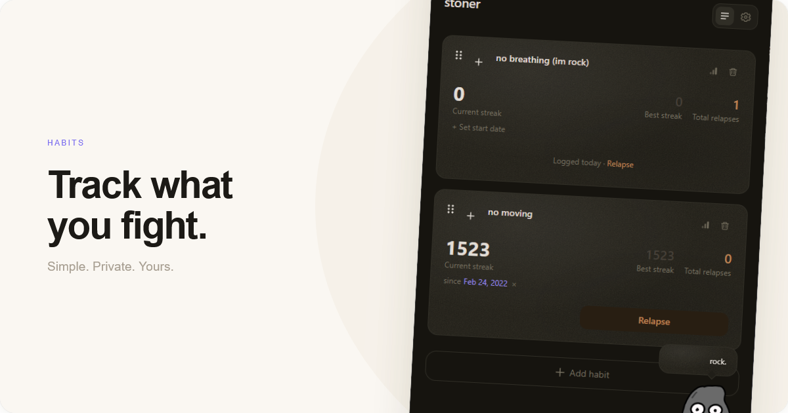
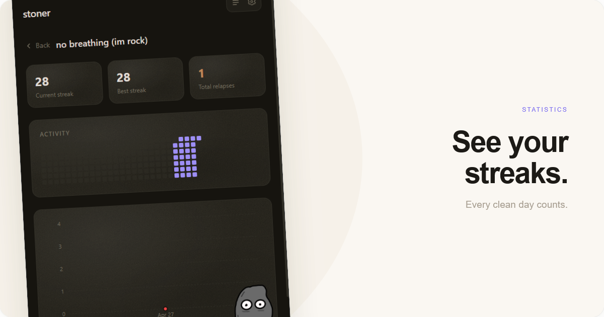
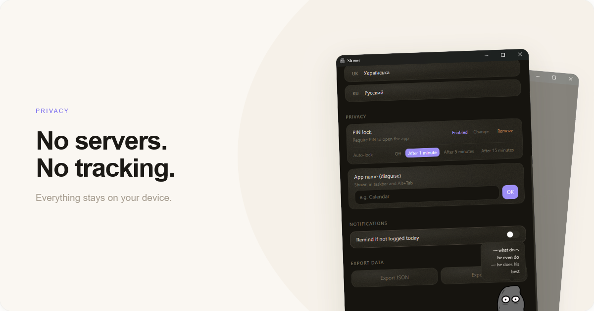
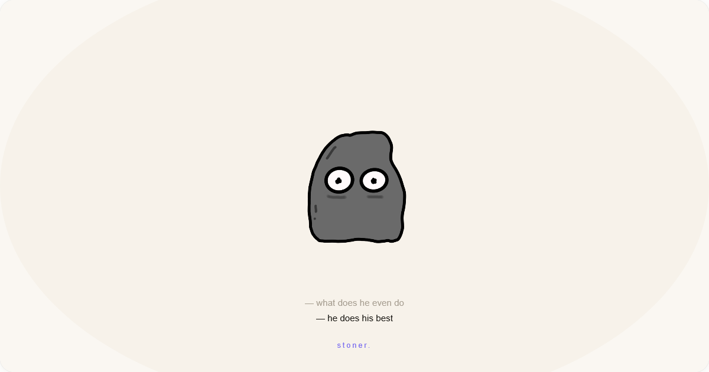

# stoner

a desktop app for tracking bad habits. built with tauri + react.






## download

grab the latest installer from [releases](../../releases).

## dev

```bash
npm install
npm run tauri dev
```
